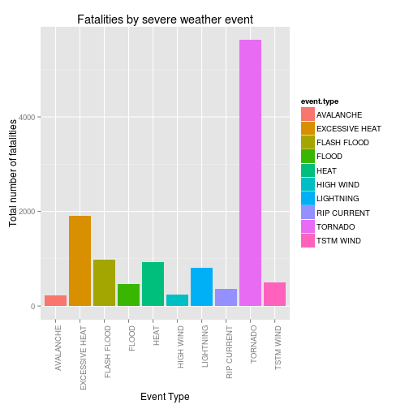
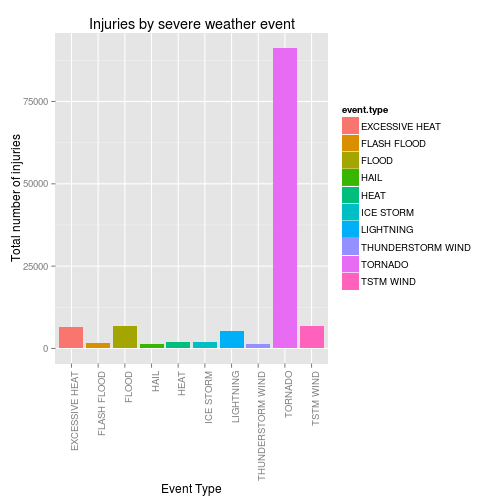
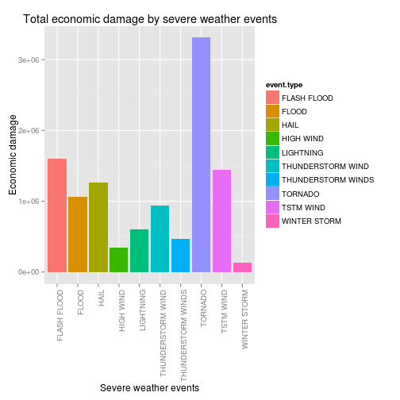

# Reproducible research Peer Assessment 2

by Novneet


## Impact of Weather Events on Public Health and Economy in the United States by the analysis of storm data

### Synopsis

Storms and other severe weather events can cause both public health and economic problems for communities and municipalities. Many severe events can result in fatalities, injuries, and property damage, and preventing such outcomes to the extent possible is a key concern.

In this project we aim to analyse and exploring  the data named **storm data** from the U.S. National Oceanic and Atmospheric Administration's (NOAA) storm database. This database tracks characteristics of major storms and weather events in the United States, including when and where they occur, as well as estimates of any fatalities, injuries, and property damage.

**This report consist of the following sections :** 

1. Getting Raw Data.
2. Processing the raw data to obtain clean Data for further analysis.
3. Observations with help of graphs and plots.
4. Conclusion

### Getting the Data

The data for comes in the form of a comma-separated-value file compressed via the bzip2 algorithm. First it is downloaded and then unzipped, if it it not already present in the present working directory.


```r
setwd(getwd())
if(!file.exists("repdata-data-StormData.csv.bz2")){
    fileurl <- "https://d396qusza40orc.cloudfront.net/repdata%2Fdata%2FStormData.csv.bz2"
    filename <- "repdata-data-StormData.csv.bz2"
    invisible(download.file(fileurl, filename, method="curl"))
}

if(!file.exists("repdata-data-StormData.csv")){
    invisible(library(R.utils))
    invisible(bunzip2("repdata-data-StormData.csv.bz2"))
} 
```

### Data Processing

The data in loaded into R.


```r
data = read.csv("repdata-data-StormData.csv")
head(data,n=3)
```

```
##   STATE__          BGN_DATE BGN_TIME TIME_ZONE COUNTY COUNTYNAME STATE
## 1       1 4/18/1950 0:00:00     0130       CST     97     MOBILE    AL
## 2       1 4/18/1950 0:00:00     0145       CST      3    BALDWIN    AL
## 3       1 2/20/1951 0:00:00     1600       CST     57    FAYETTE    AL
##    EVTYPE BGN_RANGE BGN_AZI BGN_LOCATI END_DATE END_TIME COUNTY_END
## 1 TORNADO         0                                               0
## 2 TORNADO         0                                               0
## 3 TORNADO         0                                               0
##   COUNTYENDN END_RANGE END_AZI END_LOCATI LENGTH WIDTH F MAG FATALITIES
## 1         NA         0                      14.0   100 3   0          0
## 2         NA         0                       2.0   150 2   0          0
## 3         NA         0                       0.1   123 2   0          0
##   INJURIES PROPDMG PROPDMGEXP CROPDMG CROPDMGEXP WFO STATEOFFIC ZONENAMES
## 1       15    25.0          K       0                                    
## 2        0     2.5          K       0                                    
## 3        2    25.0          K       0                                    
##   LATITUDE LONGITUDE LATITUDE_E LONGITUDE_ REMARKS REFNUM
## 1     3040      8812       3051       8806              1
## 2     3042      8755          0          0              2
## 3     3340      8742          0          0              3
```

```r
dim(data)
```

```
## [1] 902297     37
```

Extract the subset of the total data that we are interested in. The subset data contains variables which indicate in some way how they affect public health or the economy.
Remove the rows with the all the four variables - (fatalities, injuries, property damage and crop damage) equal to zero.


```r
data_subset = data[,c(8,23,24,25,26,27,28)]
names(data_subset) = c("event.type","fatalities","injuries","property.damage","property.damage.exp","crop.damage","crop.damage.exp")
data_subset = data_subset[data_subset$fatalities > 0 | data_subset$injuries > 0 |
                    data_subset$property.damage > 0 | data_subset$crop.damage > 0, ]
head(data_subset,n=3)
```

```
##   event.type fatalities injuries property.damage property.damage.exp
## 1    TORNADO          0       15            25.0                   K
## 2    TORNADO          0        0             2.5                   K
## 3    TORNADO          0        2            25.0                   K
##   crop.damage crop.damage.exp
## 1           0                
## 2           0                
## 3           0
```

We need to convert the property damage and crop damage to their actual value by help of multiplying the respective "exp" values.
The actual values are added as two new variables in the data_subset.


```r
damage_factors <- function(damage,damage.exp) {
    
  damage.exp  <-  toupper(damage.exp)
  
  if (damage.exp == "") {
    damage * 1
  } else if (damage.exp == "1") {
    damage * 10
  } else if (damage.exp == "H") {
    damage * 100
  } else if (damage.exp == "K") {
    damage * 1000
  } else if (damage.exp == "M") {
    damage * 1000000
  } else if (damage.exp == "B") {
    damage * 1000000000
  } else 0
}
data_subset$act.prop.damage = mapply(damage_factors, data_subset$property.damage, data_subset$property.damage.exp)
data_subset$act.crop.damage = mapply(damage_factors, data_subset$crop.damage, data_subset$crop.damage.exp)
```

The combined damage of crop and property variable was added which indicates the total economic damage done by an event.


```r
data_subset$combined.damage = as.numeric(data_subset$crop.damage)+as.numeric(data_subset$property.damage)
```

Now lets analyse the damage and post the results.

### Results

**Which Type of Events Is Most Harmful to Population Health?**

The effect each type of event has on population health can be shown by the help of two variables - fatalities and injuries.

First selecting those events which gave the top 10 fatalities :


```r
## Selecting the top 10 event types by total number of fatalities
fatality = aggregate(fatalities~event.type,data=data_subset, FUN=sum)
fatality = fatality[order(fatality$fatalities, decreasing = TRUE), ][1:10,c("fatalities","event.type")]
print(fatality)
```

```
##     fatalities     event.type
## 405       5633        TORNADO
## 57        1903 EXCESSIVE HEAT
## 70         978    FLASH FLOOD
## 148        937           HEAT
## 252        816      LIGHTNING
## 423        504      TSTM WIND
## 83         470          FLOOD
## 304        368    RIP CURRENT
## 197        248      HIGH WIND
## 7          224      AVALANCHE
```

Plotting top fatalities vs event type.


```r
library(ggplot2)
g1 = ggplot(data=fatality,aes(event.type,fatalities))
g1 + geom_bar(aes(fill=event.type), stat = "identity") +
     ylab("Total number of fatalities") +
     xlab("Event Type") +
     ggtitle("Fatalities by severe weather event") +
     theme(axis.text.x = element_text(angle = 90, hjust = 1))
```

 


Selecting those events which gave the top 10 injuries :


```r
## Selecting the top 10 event types by total number of fatalities
injury = aggregate(injuries~event.type,data=data_subset, FUN=sum)
injury = injury[order(injury$injuries, decreasing = TRUE), ][1:10,c("injuries","event.type")]
print(injury)
```

```
##     injuries        event.type
## 405    91346           TORNADO
## 423     6957         TSTM WIND
## 83      6789             FLOOD
## 57      6525    EXCESSIVE HEAT
## 252     5230         LIGHTNING
## 148     2100              HEAT
## 236     1975         ICE STORM
## 70      1777       FLASH FLOOD
## 365     1488 THUNDERSTORM WIND
## 131     1361              HAIL
```

Plotting top injuries vs event type.


```r
g2 = ggplot(data=injury,aes(event.type, injuries))
g2 + geom_bar(aes(fill=event.type), stat = "identity") +
     ylab("Total number of injuries") +
     xlab("Event Type") +
     ggtitle("Injuries by severe weather event") +
     theme(axis.text.x = element_text(angle = 90, hjust = 1))
```

 

**Across the United States, which types of events have the greatest economic consequences?**

To indicate economic consequences by an event, a combined damage of property and crop is taken into account. Then the top 10 events by the combined damage were selected and plotted. 


```r
economic = aggregate(combined.damage~event.type,data=data_subset,FUN="sum")
economic = economic[order(economic$combined.damage,decreasing=TRUE),][1:10,c("combined.damage","event.type")]
print(economic)
```

```
##     combined.damage         event.type
## 405         3312277            TORNADO
## 70          1599325        FLASH FLOOD
## 423         1445168          TSTM WIND
## 131         1268290               HAIL
## 83          1067976              FLOOD
## 365          943636  THUNDERSTORM WIND
## 252          606932          LIGHTNING
## 380          464978 THUNDERSTORM WINDS
## 197          342015          HIGH WIND
## 481          134700       WINTER STORM
```


```r
g3 = ggplot(data=economic, aes(event.type,combined.damage))
g3 + geom_bar(stat="identity",aes(fill=event.type)) +
     ggtitle("Total economic damage by severe weather events") +
     ylab("Economic damage") + xlab("Severe weather events") +
     theme(axis.text.x = element_text(angle = 90, hjust = 1))
```

 

### Conclusions
Based on the above analyses and figures :

* Tornado had caused the maximum damage to population health both in terms of fatalities as well as in terms of injuries. It was followed by TSTM Wind and Flood when total fatalities were concerned. In the total injured list tornado was followed by Flash Flood and TSTM Wind.

* In the category of total economic damage too tornado led the list. Not surprisingly, here also it was followed by Flash flood and TSTM Wind
